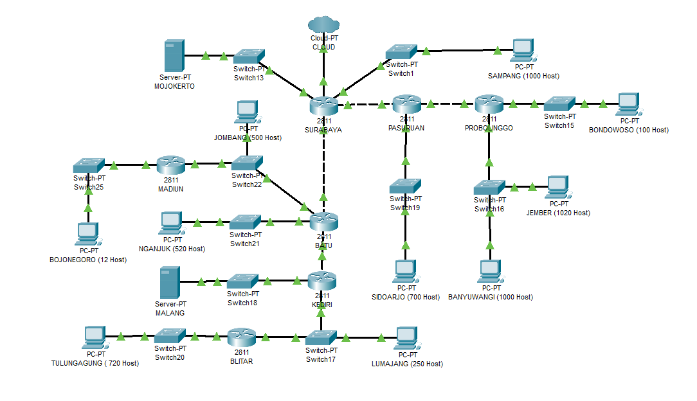
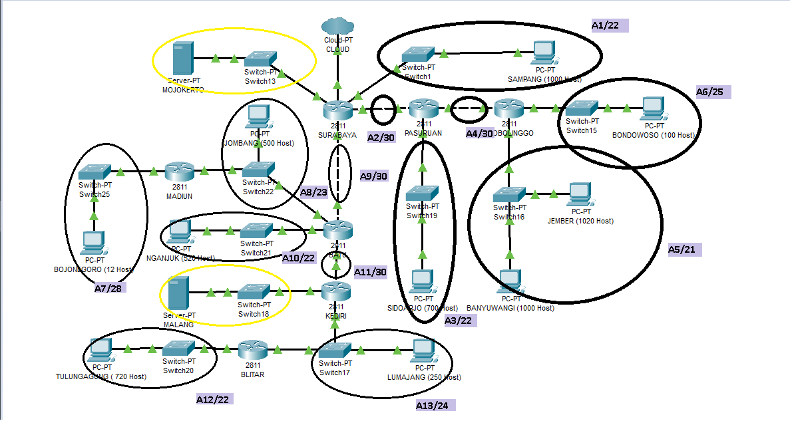
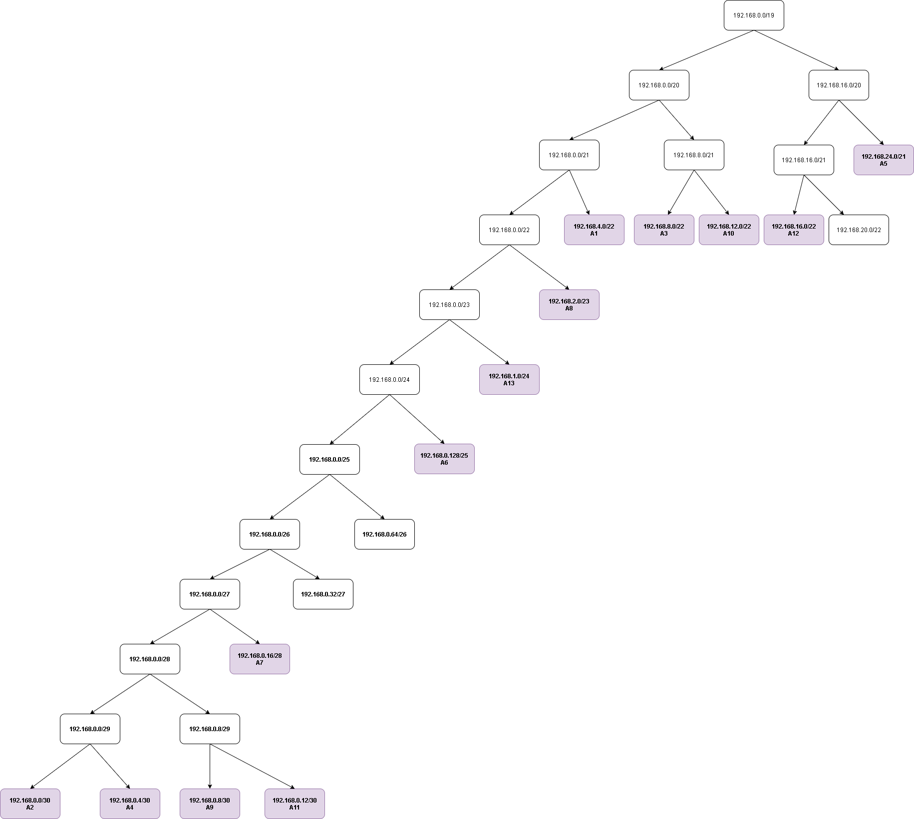
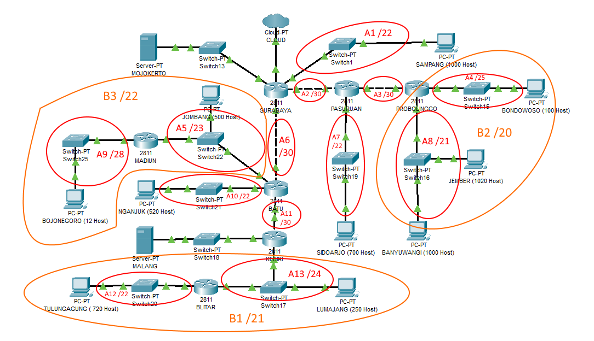
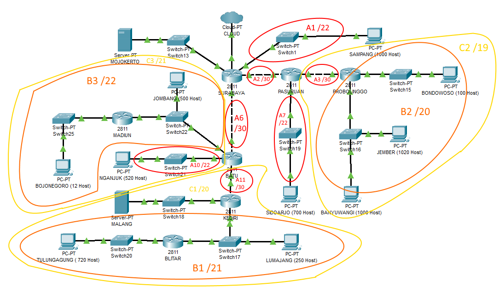
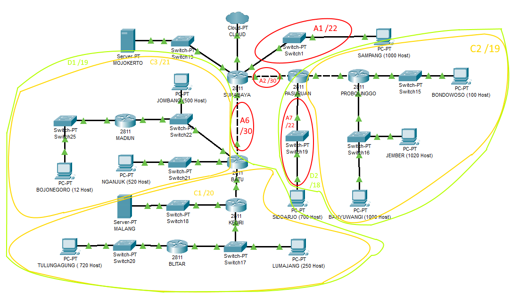
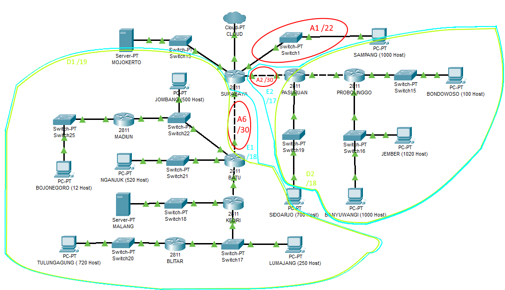
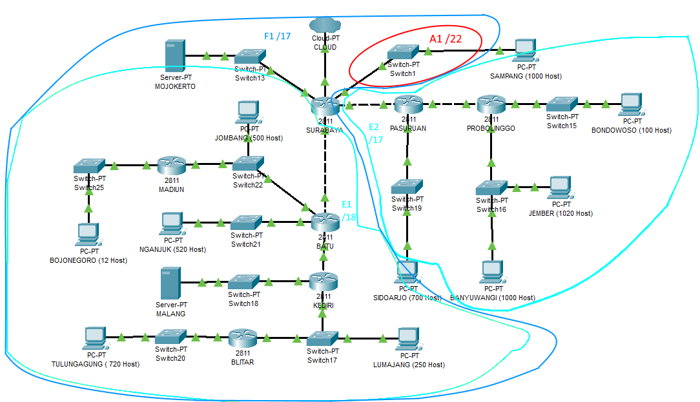
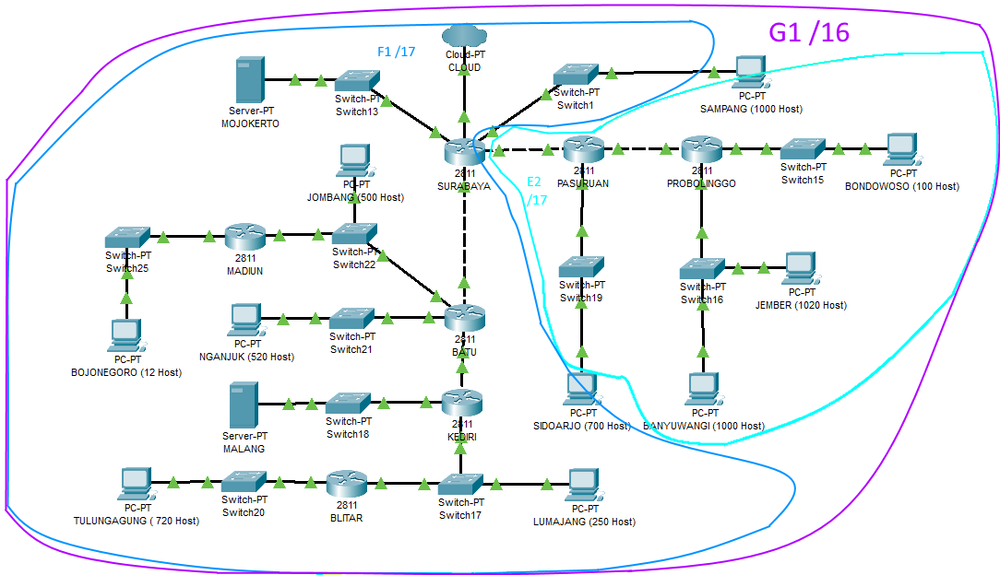
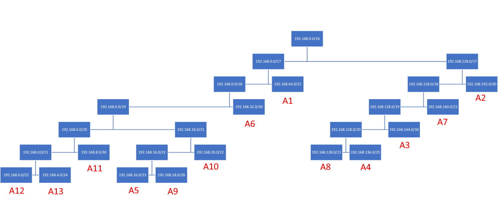

# Lapres Praktikum Jarkom Modul 4



- CLOUD diberikan IP TUNTAP.
- Server diberikan IP DMZ.
- Berikan memori sebesar 64MB pada setiap UML.
- Pembagian IP dan routing harus SE-EFISIEN MUNGKIN.
- Pastikan semua UML dapat melakukan ping ke its.ac.id
- Hasil perhitungan untuk VLSM / CIDR, berbeda dengan di CPT / UML

## VLSM / CPT

### Hasil Perhitungan

##### Langkah 1 - Tentukan subnet yang ada dalam topologi



##### Langkah 2 - Tentukan jumlah alamat IP yang dibutuhkan oleh tiap subnet dan lakukan labelling netmask berdasarkan jumlah IP yang dibutuhkan.
| Subnet| Jumlah IP | Submask |
| ------------- |:-------------:| -----:|
| A2 | 2 | /30 |
| A4 | 2 | /30 |
| A9 | 2 | /30 |
| A11 | 2 | /30 |
| A7 | 13 | /28 |
| A6 | 101 | /25 |
| A13 | 251 | /24 |
| A8 | 502 | /23 |
| A1 | 1001 | /22 |
| A3 | 701 | /22 |
| A10 | 521 | /22 |
| A12 | 721 | /22 |
| A5 | 2021 | /21 |
| **Total** | **5840** | **/19** |

### Pohon Pembagian IP



### Routing

Agar semua subnet dapat saling terhubung, tambahkan static routing berikut:

**Surabaya**
```
Network 192.168.8.0 Netmask 255.255.252.0 Next Hop 192.168.0.2 (A3/22)
Network 192.168.0.128 Netmask 255.255.255.128 Next Hop 192.168.0.2 (A6/25)
Network 192.168.24.0 Netmask 255.255.248.0 Next Hop 192.168.0.2 (A4/30)
Network 192.168.0.4 Netmask 255.255.255.252 Next Hop 192.168.0.2 (A5/21)
Network 192.168.2.0 Netmask 255.255.254.0 Next Hop 192.168.0.10 (A8/23)
Network 192.168.12.0 Netmask 255.255.252.0 Next Hop 192.168.0.10 (A10/22)
Network 192.168.0.16 Netmask 255.255.255.240 Next Hop 192.168.0.10 (A7/28)
Network 192.168.0.12 Netmask 255.255.255.252 Next Hop 192.168.0.10 (A11/30)
Network 192.168.1.0 Netmask 255.255.255.0 Next Hop 192.168.0.10 (A13/24)
Network 192.168.16.0 Netmask 255.255.252.0 Next Hop 192.168.0.10 (A12/22)
Network 10.151.77.76 Netmask 255.255.255.252 Next Hop 192.168.0.10 (Server Malang)
```

**Pasuruan**
```
Network 0.0.0.0 Netmask 0.0.0.0 Next Hop 192.168.0.1 (Default)
Network 192.168.0.128 Netmask 255.255.255.128 Next Hop 192.168.0.6 (A6/25)
Network 192.168.24.0 Netmask 255.255.248.0 Next Hop 192.168.0.6 (A5/21)
```

**Probolinggo**
```
Network 0.0.0.0 Netmask 0.0.0.0 Next Hop 192.168.0.5 (default)
```

**Batu**
```
Network 0.0.0.0 Netmask 0.0.0.0 Next Hop 192.168.0.9 (default)
Network 192.168.0.16 Netmask 255.255.255.240 Next Hop 192.168.2.3 (A7/28)
Network 192.168.1.0 Netmask 255.255.255.0 Next Hop 192.168.0.14 (A13/24)
Network 192.168.16.0 Netmask 255.255.252.0 Next Hop 192.168.0.14 (A12/22)
Network 10.151.77.76 Netmask 255.255.255.252 Next Hop 192.168.0.14 (Server Malang)
```

**MADIUN**
```
Network 0.0.0.0 Netmask 0.0.0.0 Next Hop 192.168.2.1 (Default)
```

**KEDIRI**
```
Network 0.0.0.0 Netmask 0.0.0.0 Next Hop 192.168.0.13 (Default)
Network 192.168.16.0 Netmask 255.255.252.0 Next Hop 192.168.1.3 (A12/22)
```

**BLITAR**
```
Network 0.0.0.0 Netmask 0.0.0.0 Next Hop 192.168.1.1 (Default)
```

## CIDR / UML

### Hasil Perhitungan

##### Langkah 1 - Tentukan subnet yang ada dalam topologi dan lakukan labelling netmask terhadap masing-masing subnet.


##### Langkah 2 - Gabungkan subnet paling bawah di dalam topologi, diulang sampai menjadi sebuah subnet besar mencakup 1 topologi













### Pohon Pembagian IP



### Routing

```
# ROUTING SURABAYA
route add -net 192.168.0.0 netmask 255.255.224.0 gw 192.168.32.2
route add -net 192.168.128.0 netmask 255.255.128.0 gw 192.168.192.2
route add -net 10.151.77.76 netmask 255.255.255.252 gw 192.168.32.2

# ROUTING  BATU
route add -net 192.168.0.0 netmask 255.255.248.0 gw 192.168.8.2
route add -net 192.168.18.0 netmask 255.255.255.240 gw 192.168.16.2
route add -net 10.151.77.76 netmask 255.255.255.252 gw 192.168.8.2

# ROUTING KEDIRI
route add -net 192.168.0.0 netmask 255.255.252.0 gw 192.168.4.2

# ROUTING PASURUAN
route add -net 192.168.128.0 netmask 255.255.240.0 gw 192.168.144.2
```
