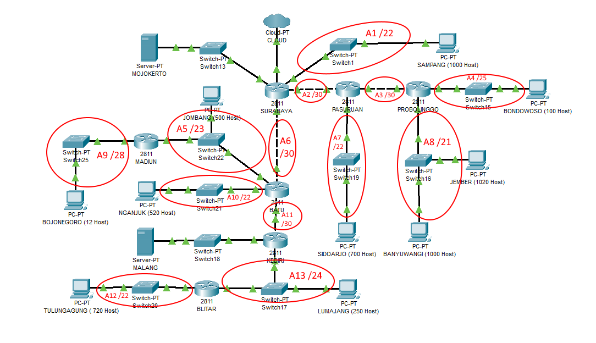

# Lapres Praktikum Jarkom Modul 4


- CLOUD diberikan IP TUNTAP.
- Server diberikan IP DMZ.
- Berikan memori sebesar 64MB pada setiap UML.
- Pembagian IP dan routing harus SE-EFISIEN MUNGKIN.
- Pastikan semua UML dapat melakukan ping ke its.ac.id

## VLSM / CPT

### Hasil Perhitungan

### Pohon Pembagian IP

### Routing

## CIDR / UML

### Hasil Perhitungan

##### Langkah 1 - Tentukan subnet yang ada dalam topologi dan lakukan labelling netmask terhadap masing-masing subnet.



##### Langkah 2 - Gabungkan subnet paling bawah di dalam topologi, diulang sampai menjadi sebuah subnet besar mencakup 1 topologi


### Pohon Pembagian IP


### Routing

```
# ROUTING SURABAYA
route add -net 192.168.0.0 netmask 255.255.224.0 gw 192.168.32.2
route add -net 192.168.128.0 netmask 255.255.128.0 gw 192.168.192.2
route add -net 10.151.77.76 netmask 255.255.255.252 gw 192.168.32.2

# ROUTING  BATU
route add -net 192.168.0.0 netmask 255.255.248.0 gw 192.168.8.2
route add -net 192.168.18.0 netmask 255.255.255.240 gw 192.168.16.2
route add -net 10.151.77.76 netmask 255.255.255.252 gw 192.168.8.2

# ROUTING KEDIRI
route add -net 192.168.0.0 netmask 255.255.252.0 gw 192.168.4.2

# ROUTING PASURUAN
route add -net 192.168.128.0 netmask 255.255.240.0 gw 192.168.144.2
```