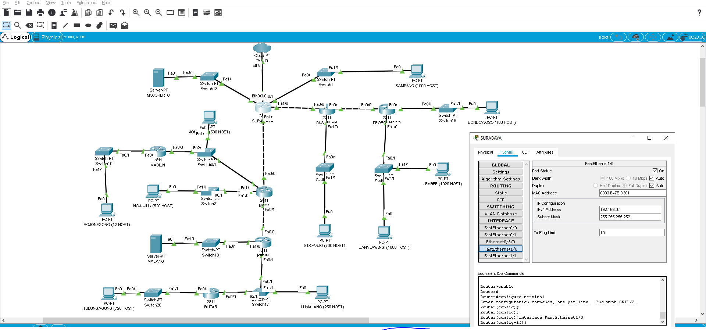
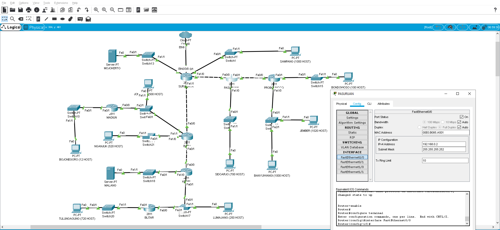
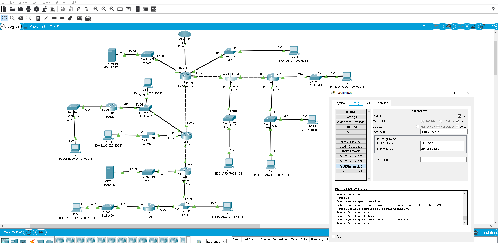
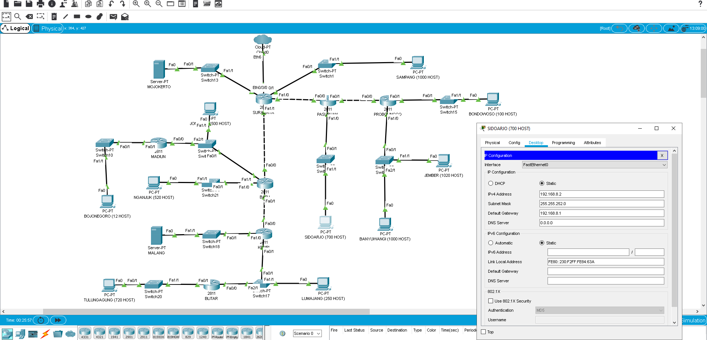
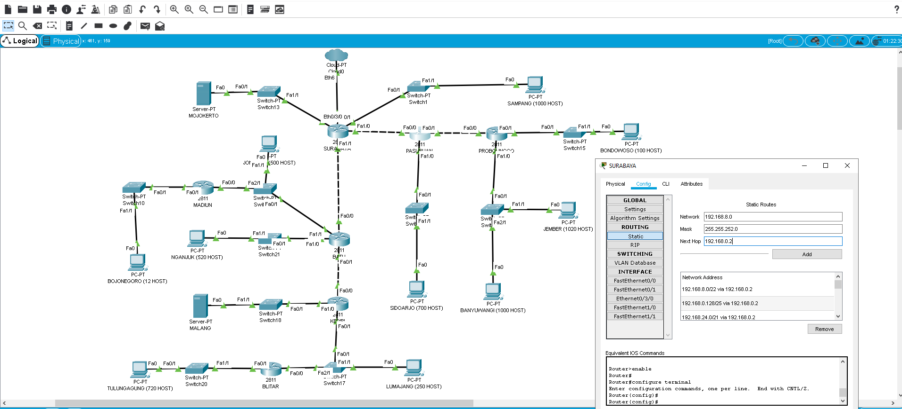
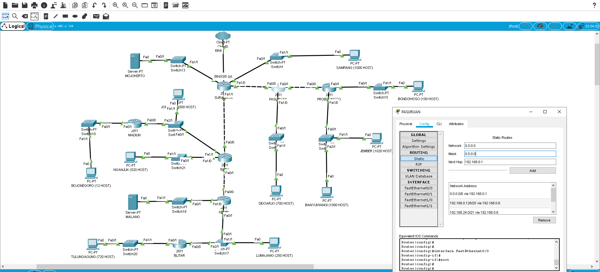

# Lapres Praktikum Jarkom Modul 4


- CLOUD diberikan IP TUNTAP.
- Server diberikan IP DMZ.
- Berikan memori sebesar 64MB pada setiap UML.
- Pembagian IP dan routing harus SE-EFISIEN MUNGKIN.
- Pastikan semua UML dapat melakukan ping ke its.ac.id
- Hasil perhitungan untuk VLSM / CIDR, berbeda dengan di CPT / UML

## VLSM / CPT

### Hasil Perhitungan

##### Langkah 1 - Tentukan subnet yang ada dalam topologi


##### Langkah 2 - Tentukan jumlah alamat IP yang dibutuhkan oleh tiap subnet dan lakukan labelling netmask berdasarkan jumlah IP yang dibutuhkan.
| Subnet| Jumlah IP | Submask |
| ------------- |:-------------:| -----:|
| A2 | 2 | /30 |
| A4 | 2 | /30 |
| A9 | 2 | /30 |
| A11 | 2 | /30 |
| A7 | 13 | /28 |
| A6 | 101 | /25 |
| A13 | 251 | /24 |
| A8 | 502 | /23 |
| A1 | 1001 | /22 |
| A3 | 701 | /22 |
| A10 | 521 | /22 |
| A12 | 721 | /22 |
| A5 | 2021 | /21 |
| **Total** | **5840** | **/19** |

### Pohon Pembagian IP


Melalui pohon diatas, maka diperoleh tabel IP akhir sebagai berikut:

| Subnet | Jumlah IP | Submask | Netmask | NID |
| ------------- |:-------------:| -----:| -----: | -----: |
| A2 | 2 | /30 | 255.255.255.252 | 192.168.0.0 |
| A4 | 2 | /30 | 255.255.255.252 | 192.168.0.4 |
| A9 | 2 | /30 | 255.255.255.252 | 192.168.0.8 |
| A11 | 2 | /30 | 255.255.255.252 | 192.168.0.12 |
| A7 | 13 | /28 | 255.255.255.240 | 192.168.0.16 |
| A6 | 101 | /25 | 255.255.255.128 | 192.168.0.128 |
| A13 | 251 | /24 | 255.255.255.0 | 192.168.1.0 |
| A8 | 502 | /23 | 255.255.254.0 | 192.168.2.0 |
| A1 | 1001 | /22 | 255.255.252.0 | 192.168.4.0 |
| A3 | 701 | /22 | 255.255.252.0 | 192.168.8.0 |
| A10 | 521 | /22 | 255.255.252.0 | 192.168.12.0 |
| A12 | 721 | /22 | 255.255.252.0 | 192.168.16.0 |
| A5 | 2021 | /21 | 255.255.248.0 | 192.168.24.0 |
| **Total** | **5840** | **/19** |

IP Untuk Server:

| Subnet | Jumlah IP | Submask | Netmask | NID |
| ------------- |:-------------:| -----:| -----: | -----: |
| Mojokerto | 2 | /30 | 255.255.255.252 | NID DMZ |
| Malang | 2 | /30 | 255.255.255.252 | NID DMZ + 4 |

### Konfigurasi Interface

Agar jaringan yang telah dibuat pada Cisco Packet Tracer dapat terhubung, dilakukan konfigurasi interface untuk masing - masing hardware sebagai berikut sebagai contoh:

**Konfigurasi interface antar hardware (Router - Router)**

Konfigurasi interface akan dilakukan untuk Subnet A2.

##### Langkah 1 - Pilih router SURABAYA dan pilih tab **Config**  -> **Interface** dan pilih interface SURABAYA yang mengarah kepada router PASURUAN
##### Langkah 2 - Masukkan **IPV4 Address** berupa NID Subnet + 1 dan Subnet Mask sesuai dengan tabel subnet yang telah dibuat sebelumnya



##### Langkah 3 - Pilih router PASURUAN dan pilih tab **Config**  -> **Interface** dan pilih interface PASURUAN yang mengarah kepada router SURABAYA
##### Langkah 4 - Masukkan **IPV4 Address** berupa NID Subnet + 2 dan Subnet Mask sesuai dengan tabel subnet yang telah dibuat sebelumnya



**Konfigurasi interface antar hardware (Router - Client / Server)**

Konfigurasi interface akan dilakukan untuk Subnet A3.

##### Langkah 1 - Pilih router PASURUAN dan pilih tab **Config**  -> **Interface** dan pilih interface PASURUAN yang mengarah kepada client SIDOARJO
##### Langkah 2 - Masukkan **IPV4 Address** berupa NID Subnet + 1 dan Subnet Mask sesuai dengan tabel subnet yang telah dibuat sebelumnya



##### Langkah 3 - Pilih client SIDOARJO dan pilih tab **Config**  -> **Desktop**
##### Langkah 4 - Masukkan **IPV4 Address** berupa NID Subnet + 2, Subnet Mask sesuai dengan tabel subnet yang telah dibuat sebelumnya, dan Default Gateway berupa NID Subnet + 1



### Routing

Untuk melakukan routing, akan diberikan langkah - langkah yang diperlukan agar route yang telah dibuat dapat diterapkan pada topologi.

**Routing untuk Subnet**

Sebagai contoh, akan dilakukan routing untuk subnet A3 pada router SURABAYA.

##### Langkah 1 - Pilih router SURABAYA dan pilih tab **Config** -> **Routing** ->  **Static**
##### Langkah 2 - Masukkan Network berupa NID Subnet, Mask sesuai dengan Submask yang telah ditentukan pada tabel, dan Next Hop berupa IP Interface router subnet yang mengarah ke SURABAYA. pada Subnet ini, router tersebut adalah PASURUAN



**Default Routing**

Default routing dilakukan untuk router - router yang tidak langsung tersambung ke cloud. Sebagai contoh, PASURUAN.

##### Langkah 1 - Pilih router PASURUAN dan pilih tab **Config** -> **Routing** ->  **Static**
##### Langkah 2 - Masukkan Network berupa 0.0.0.0, Mask berupa 0.0.0.0, dan Next Hop berupa IP Interface router sebelum PASURUAN yang mengarah ke router itu sendiri. pada default routing untuk router PASURUAN, router tersebut adalah SURABAYA



Tabel routing seluruh Subnet untuk topologi:

**SURABAYA**
```
Network 192.168.8.0 Netmask 255.255.252.0 Next Hop 192.168.0.2 (A3/22)
Network 192.168.0.128 Netmask 255.255.255.128 Next Hop 192.168.0.2 (A6/25)
Network 192.168.24.0 Netmask 255.255.248.0 Next Hop 192.168.0.2 (A4/30)
Network 192.168.0.4 Netmask 255.255.255.252 Next Hop 192.168.0.2 (A5/21)
Network 192.168.2.0 Netmask 255.255.254.0 Next Hop 192.168.0.10 (A8/23)
Network 192.168.12.0 Netmask 255.255.252.0 Next Hop 192.168.0.10 (A10/22)
Network 192.168.0.16 Netmask 255.255.255.240 Next Hop 192.168.0.10 (A7/28)
Network 192.168.0.12 Netmask 255.255.255.252 Next Hop 192.168.0.10 (A11/30)
Network 192.168.1.0 Netmask 255.255.255.0 Next Hop 192.168.0.10 (A13/24)
Network 192.168.16.0 Netmask 255.255.252.0 Next Hop 192.168.0.10 (A12/22)
Network 10.151.77.76 Netmask 255.255.255.252 Next Hop 192.168.0.10 (Server Malang)
```

**PASURUAN**
```
Network 0.0.0.0 Netmask 0.0.0.0 Next Hop 192.168.0.1 (Default)
Network 192.168.0.128 Netmask 255.255.255.128 Next Hop 192.168.0.6 (A6/25)
Network 192.168.24.0 Netmask 255.255.248.0 Next Hop 192.168.0.6 (A5/21)
```

**PROBOLINGGO**
```
Network 0.0.0.0 Netmask 0.0.0.0 Next Hop 192.168.0.5 (default)
```

**BATU**
```
Network 0.0.0.0 Netmask 0.0.0.0 Next Hop 192.168.0.9 (default)
Network 192.168.0.16 Netmask 255.255.255.240 Next Hop 192.168.2.3 (A7/28)
Network 192.168.1.0 Netmask 255.255.255.0 Next Hop 192.168.0.14 (A13/24)
Network 192.168.16.0 Netmask 255.255.252.0 Next Hop 192.168.0.14 (A12/22)
Network 10.151.77.76 Netmask 255.255.255.252 Next Hop 192.168.0.14 (Server Malang)
```

**MADIUN**
```
Network 0.0.0.0 Netmask 0.0.0.0 Next Hop 192.168.2.1 (Default)
```

**KEDIRI**
```
Network 0.0.0.0 Netmask 0.0.0.0 Next Hop 192.168.0.13 (Default)
Network 192.168.16.0 Netmask 255.255.252.0 Next Hop 192.168.1.3 (A12/22)
```

**BLITAR**
```
Network 0.0.0.0 Netmask 0.0.0.0 Next Hop 192.168.1.1 (Default)
```

## CIDR / UML

### Hasil Perhitungan

##### Langkah 1 - Tentukan subnet yang ada dalam topologi dan lakukan labelling netmask terhadap masing-masing subnet.


##### Langkah 2 - Gabungkan subnet paling bawah di dalam topologi, diulang sampai menjadi sebuah subnet besar mencakup 1 topologi


### Pohon Pembagian IP


### Routing

```
# ROUTING SURABAYA
route add -net 192.168.0.0 netmask 255.255.224.0 gw 192.168.32.2
route add -net 192.168.128.0 netmask 255.255.128.0 gw 192.168.192.2
route add -net 10.151.77.76 netmask 255.255.255.252 gw 192.168.32.2

# ROUTING  BATU
route add -net 192.168.0.0 netmask 255.255.248.0 gw 192.168.8.2
route add -net 192.168.18.0 netmask 255.255.255.240 gw 192.168.16.2
route add -net 10.151.77.76 netmask 255.255.255.252 gw 192.168.8.2

# ROUTING KEDIRI
route add -net 192.168.0.0 netmask 255.255.252.0 gw 192.168.4.2

# ROUTING PASURUAN
route add -net 192.168.128.0 netmask 255.255.240.0 gw 192.168.144.2
```
